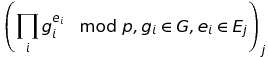
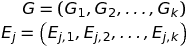
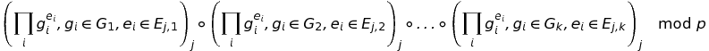
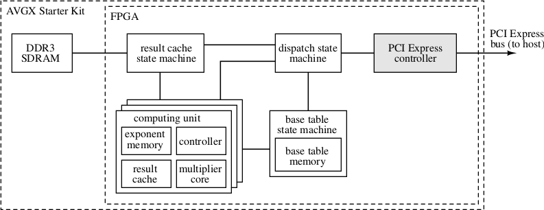

# multiexp-a5gx #

An FPGA-based PCIe hardware accelerator for modular multiexponentiation based on the
[Altera Arria 5 GX Starter Kit](https://www.altera.com/products/boards_and_kits/dev-kits/altera/kit-arria-v-starter.html).

## Overview ##

multiexp-a5gx accelerates *batched modular multiexponentiation* for large Crandall primes (i.e., primes of the form 2n−k for small k \[[Crandall92](http://patentimages.storage.googleapis.com/pdfs/US5159632.pdf)\]).

### Algorithm ###

Given a Crandall prime p, and two vectors *G* and *E*, where *G* are *bases* and *E* are *exponents*, define *modular multiexponentiation* as

Define *batched modular multiexponentiation* as follows: given a vector *G* of bases, and j vectors of exponents *E*j, compute the vector

There are many algorithms for improving the speed of modular multiexponentiation compared to the
naive approach (i.e., exponentiating each base to the corresponding exponent and then computing
the product). Most of these involve a precomputation step whose results can be reused throughout
the rest of the computation, resulting in less overall work \[[Möller08](http://www.bmoeller.de/pdf/TI-01-08.multiexp.pdf)\].

Since we are reusing the same bases *G* repeatedly, we choose an algorithm whose precomputation
involves only *G* and not *E*j. Our algorithm is similar to the Simultaneous 2w-ary method
\[[Möller08](http://www.bmoeller.de/pdf/TI-01-08.multiexp.pdf), §2.1\].
However, because of the memory limitations of the FPGA, we perform modular multiexponentiation
in sub-batches.  To do this, we first subdivide the vectors *G* and *E*j into subvectors
of length 1024. That is,

Next, we compute

where *A*∘*B* is the [Hadamard product](http://en.wikipedia.org/wiki/Hadamard_product_%28matrices%29),
i.e., entrywise multiplication. To do this efficiently, we allocate an accumulator in RAM for each
*E*j; after computing multiexponentiation for each subvector, we multiply the accumulator
by this value and store the new result.

### Accelerator architecture ###

The following block diagram illustrates the organization of multiexp-a5gx:

The *host system* (that is, the system to which the A5GX Starter Kit is connected) communicates
via PCIe using [Xillybus](http://www.xillybus.com).

The *dispatch state machine* processes commands and data from the host, and coordinates interaction
among the other subsystems.

The *base table state machine* coordinates access to the base table, which stores the results
of the precomputation over the bases, *G*, described in the previous section.

The *computing units* execute the exponentiation operation in parallel, operating in lockstep
on the shared base table data and the per–computing unit exponent data. Results are stored
in the local *result cache*.

The *result cache state machine* handles background transfers between the result caches of the
computing units and the off-chip RAM.

### Default parameters ###

By default, multiexp-a5gx uses p = 21077 - 33, and thus *G* and *E* are vectors of
1077-bit numbers. This configuration can be modified, but note that the hardware is specialized
to particular parameters at synthesis time, so changing p requires resynthesizing the FPGA
configuration.

In the default configuration, there are 16 parallel computing units.

The maximum core operating frequency in the default configuration is 125 MHz. Other configurations
may result in higher or lower operating frequencies.

### Performance ###

Each computing unit of multiexp-a5gx in the default configuration can perform multiexponentiations
about as fast as one core of a 3.2 MHz Haswell processor.

multiexp-a5gx draws about 5 watts with all 16 multiplier units in operation, while each Haswell
core draws about 10 watts; in other words, the specialized hardware gives about a 30x increase
in computations per joule.

## Building the hardware ##

### Requirements ###

This project is specifically designed to work with the
[Altera Arria 5 GX Starter Kit](https://www.altera.com/products/boards_and_kits/dev-kits/altera/kit-arria-v-starter.html).

It will almost certainly *not* work without modification on any other hardware. However, you should
be able to port it to other hardware. This will likely involve swapping out vendor-provided blocks
(i.e., the DDR3 controller, PCIe phy, PLL, and Xillybus PCIe interface), especially if you are
attempting to port this to a Xilinx FPGA.

### Compiling and programming the hardware ###

To compile this project, you will need a working install of
[QuartusII v14](https://www.altera.com/products/design-software/fpga-design/quartus-ii/overview.html).

1. Generate Altera hardware blocks. Note that you don't need to generate the example projects.

   a. Open `ddr3/ddr3_x32.v`, which will launch the MegaWizard. Press OK.

   b. Open `pcie/pcie_c5_4x.v`, which will launch the MegaWizard. Press OK.

   c. Open `pll/pll_core.v`, which will launch the MegaWizard. Press OK.

2. In `a5_multiexp.qsf`, remove all instance assignments including the substring `-tag __ddr3_x32_p0`, if any exist.

3. Open the `a5_multiexp.qpf` project.

4. For now, run *only* Analysis & Synthesis.

5. Tools -> Tcl Scripts... -> `ddr3/ddr3_x32_p0_pin_assignments.tcl` -> Run.

6. In Assignments -> Settings -> Compilation Process Settings, make sure that "Run I/O Assignment
analysis before compilation" is *enabled*.

7. Run full project compile.

8. Go get some coffee. This will take a while.

9. Program device.

### Simulating the hardware ###

The `sim` subdirectory contains testbench setups suitable for simulating various parts of
multiexp-a5gx. These benches were written for use with Modelsim, but should work with other
Verilog simulators. Please see your simulator's documentation for more information.

## Building the software ##

To use the above hardawre, you will need working Xillybus drivers, and you will need to build
the mexpdrv library included in the `src/mexpdrv` subdirectory.

For information on installing the Xillybus driver, see the [Xillybus documentation](http://www.xillybus.com/doc).

To compile mexpdrv, you will need a relatively recent version of gcc (tested with 4.7 and later).
In addition, you will need to have the [GNU MP](https://gmplib.org) library installed, along
with its header files. (The headers are often distributed in a separate "development" package;
on Debian-like systems, for example, this package is called `libgmp-dev`.)

There are several utilities in the `src/mexpdrv` subfolder, but the two important ones are
`mexpdrv.{c,h}` and `batch_test.c`. `mexpdrv.{c,h}` are a library that provides a higher-level
interface to the underlying hardware.  `batch_test.c` demonstrates the use of this library
to perform batch multiexponentiation.

You should be able to simply

    cd src/mexpdrv
    make

and then run multiexponentiation tests using `batch_test`.

## Licensing ##

Besides the Altera and Xillybus cores, discussed below, multiexp-a5gx is
Copyright © 2014-2015 Riad S. Wahby.

multiexp-a5gx is free software: you can redistribute it and/or modify
it under the terms of the GNU General Public License as published by
the Free Software Foundation, either version 3 of the License, or
(at your option) any later version.

This program is distributed in the hope that it will be useful,
but WITHOUT ANY WARRANTY; without even the implied warranty of
MERCHANTABILITY or FITNESS FOR A PARTICULAR PURPOSE.  See the
GNU General Public License for more details.

You should have received a copy of the GNU General Public License
along with this program. If not, see http://www.gnu.org/licenses/.

### Altera cores ###

All Altera cores are Copyright © 1991-2015 Altera Corporation. Your license to use these cores
should have been obtained along with the
[QuartusII software](https://www.altera.com/products/design-software/fpga-design/quartus-ii/overview.html).

The following files are part of the Altera cores, and are covered by Altera's licensing terms:

* `ddr3/ddr3_x32.v`
* `ocram/e_ram.v`
* `ocram/g_ram.v`
* `ocram/t_ram.v`
* `pcie/pcie_c5_4x.v`
* `pll/pll_core.v`
* `sim/alt_mem_if_common_ddr_mem_model_ddr3_mem_if_dm_pins_en_mem_if_dqsn_en.sv`
* `sim/alt_mem_if_ddr3_mem_model_top_ddr3_mem_if_dm_pins_en_mem_if_dqsn_en.sv`
* `sim/modelsim.ini`
* `sim/msim_setup.tcl`

### Xillybus ###

This project uses the [Xillybus](http://xillybus.com) PCIe core. This core is Copyright © 2010-2015
Xillybus Ltd.

Evaluation and educational use are allowed by the [licensing terms](http://xillybus.com/licensing).
If your use does not fall under the Evaluation or Educational licenses, you will need to obtain
a license appropriate to your use.

The following files are part of the Xillybus PCIe core, and are covered by the above-linked
licensing terms:

* `xilly/xillybus_core.qxp`
* `verilog/xillybus.v`
